# ERD — Photobooth SaaS On-Site & Online

---

## 1. Informasi Dokumen

| Item | Detail |
|---|---|
| Nama Produk | Photobooth SaaS |
| Dokumen | Entity Relationship Diagram (ERD) |
| Versi | 1.0 |
| Status | Draft |
| Backend | Laravel |
| Frontend | React |
| Database | MySQL |
| Arsitektur | Multi-Tenant SaaS |

---

# 2. Tujuan ERD

ERD digunakan untuk menggambarkan struktur data dan hubungan antar-entitas pada Photobooth SaaS. Struktur ini diturunkan dari kebutuhan bisnis, PRD, dan Use Case yang telah dibuat sebelumnya.

ERD mencakup:

- Multi-tenant.
- User dan role/permission.
- Subscription.
- Business profile.
- Package.
- Event.
- Operator.
- Template dan desain.
- Template version dan photo slot.
- Photo session.
- Customer.
- Foto hasil capture.
- Final result.
- Transaction dan payment.
- Notification.
- Media/file.
- Audit log.

---

# 3. Entitas Utama

```text
TENANT
├── USERS
├── BUSINESS_PROFILE
├── SUBSCRIPTION
├── PACKAGES
├── EVENTS
├── TEMPLATES
├── CUSTOMERS
├── PHOTO_SESSIONS
├── TRANSACTIONS
├── NOTIFICATIONS
├── MEDIA_FILES
└── AUDIT_LOGS

TEMPLATE
└── TEMPLATE_VERSIONS
    ├── TEMPLATE_PHOTO_SLOTS
    └── TEMPLATE_ELEMENTS

EVENT
├── EVENT_OPERATORS
├── EVENT_TEMPLATES
└── PHOTO_SESSIONS

PHOTO_SESSION
├── SESSION_PHOTOS
├── PHOTO_RESULTS
└── CUSTOMER
```

---

# 4. ERD — Mermaid

> Diagram berikut dapat dirender menggunakan Mermaid pada editor yang mendukung Mermaid.

```mermaid
erDiagram

    TENANTS {
        bigint id PK
        varchar name
        varchar slug UK
        bigint logo_media_id FK
        varchar status
        timestamp created_at
        timestamp updated_at
    }

    USERS {
        bigint id PK
        bigint tenant_id FK
        varchar name
        varchar email UK
        varchar password
        varchar status
        timestamp last_login_at
        timestamp created_at
        timestamp updated_at
    }

    ROLES {
        bigint id PK
        varchar name
        varchar guard_name
        timestamp created_at
        timestamp updated_at
    }

    PERMISSIONS {
        bigint id PK
        varchar name
        varchar guard_name
        timestamp created_at
        timestamp updated_at
    }

    ROLE_USER {
        bigint role_id PK,FK
        bigint user_id PK,FK
    }

    PERMISSION_ROLE {
        bigint permission_id PK,FK
        bigint role_id PK,FK
    }

    BUSINESS_PROFILES {
        bigint id PK
        bigint tenant_id FK,UK
        varchar business_name
        text description
        varchar email
        varchar phone
        text address
        bigint logo_media_id FK
        json branding_json
        timestamp created_at
        timestamp updated_at
    }

    SUBSCRIPTION_PLANS {
        bigint id PK
        varchar name
        text description
        decimal price
        varchar billing_period
        int max_events
        int max_sessions
        int max_templates
        bigint max_storage_mb
        varchar status
        timestamp created_at
        timestamp updated_at
    }

    TENANT_SUBSCRIPTIONS {
        bigint id PK
        bigint tenant_id FK
        bigint plan_id FK
        varchar status
        timestamp started_at
        timestamp ends_at
        timestamp trial_ends_at
        varchar external_subscription_id
        timestamp created_at
        timestamp updated_at
    }

    PACKAGES {
        bigint id PK
        bigint tenant_id FK
        varchar name
        text description
        decimal price
        int duration_minutes
        int max_sessions
        varchar status
        timestamp created_at
        timestamp updated_at
    }

    PACKAGE_TEMPLATES {
        bigint package_id PK,FK
        bigint template_id PK,FK
    }

    EVENTS {
        bigint id PK
        bigint tenant_id FK
        bigint package_id FK
        varchar name
        text description
        date event_date
        time start_time
        time end_time
        varchar location
        varchar status
        varchar online_slug UK
        varchar online_access_token
        boolean online_enabled
        timestamp created_at
        timestamp updated_at
    }

    EVENT_OPERATORS {
        bigint event_id PK,FK
        bigint user_id PK,FK
        timestamp assigned_at
    }

    EVENT_TEMPLATES {
        bigint event_id PK,FK
        bigint template_id PK,FK
        boolean is_default
        int sort_order
        timestamp created_at
        timestamp updated_at
    }

    TEMPLATES {
        bigint id PK
        bigint tenant_id FK
        varchar name
        varchar paper_size
        varchar orientation
        int canvas_width
        int canvas_height
        varchar status
        bigint current_version_id FK
        bigint preview_media_id FK
        timestamp created_at
        timestamp updated_at
    }

    TEMPLATE_VERSIONS {
        bigint id PK
        bigint template_id FK
        int version_number
        bigint design_media_id FK
        bigint preview_media_id FK
        int canvas_width
        int canvas_height
        varchar status
        bigint created_by FK
        timestamp created_at
        timestamp updated_at
    }

    TEMPLATE_PHOTO_SLOTS {
        bigint id PK
        bigint template_version_id FK
        varchar slot_key
        int slot_order
        decimal position_x
        decimal position_y
        decimal width
        decimal height
        decimal rotation
        varchar crop_mode
        varchar mask_type
        json mask_config_json
        timestamp created_at
        timestamp updated_at
    }

    TEMPLATE_ELEMENTS {
        bigint id PK
        bigint template_version_id FK
        varchar element_type
        int z_index
        decimal position_x
        decimal position_y
        decimal width
        decimal height
        decimal rotation
        bigint media_id FK
        json config_json
        timestamp created_at
        timestamp updated_at
    }

    CUSTOMERS {
        bigint id PK
        bigint tenant_id FK
        varchar name
        varchar email
        varchar phone
        timestamp created_at
        timestamp updated_at
    }

    PHOTO_SESSIONS {
        bigint id PK
        bigint tenant_id FK
        bigint event_id FK
        bigint customer_id FK
        bigint operator_id FK
        varchar mode
        varchar session_token UK
        varchar status
        bigint selected_template_version_id FK
        int retake_count
        timestamp started_at
        timestamp completed_at
        timestamp expires_at
        timestamp created_at
        timestamp updated_at
    }

    SESSION_PHOTOS {
        bigint id PK
        bigint session_id FK
        int capture_order
        bigint media_id FK
        varchar status
        bigint retake_of_id FK
        timestamp captured_at
        timestamp created_at
        timestamp updated_at
    }

    PHOTO_RESULTS {
        bigint id PK
        bigint session_id FK
        bigint template_version_id FK
        bigint final_media_id FK
        varchar result_token UK
        text qr_payload
        varchar status
        timestamp generated_at
        timestamp expires_at
        timestamp created_at
        timestamp updated_at
    }

    PHOTO_RESULT_ITEMS {
        bigint id PK
        bigint result_id FK
        bigint session_photo_id FK
        bigint template_photo_slot_id FK
        json crop_config_json
        timestamp created_at
        timestamp updated_at
    }

    TRANSACTIONS {
        bigint id PK
        bigint tenant_id FK
        bigint customer_id FK
        bigint package_id FK
        bigint event_id FK
        bigint tenant_subscription_id FK
        varchar type
        varchar invoice_number UK
        decimal amount
        varchar currency
        varchar status
        timestamp transaction_date
        timestamp due_at
        timestamp created_at
        timestamp updated_at
    }

    PAYMENTS {
        bigint id PK
        bigint transaction_id FK
        varchar provider
        varchar method
        decimal amount
        varchar external_reference
        varchar status
        timestamp paid_at
        json raw_response_json
        timestamp created_at
        timestamp updated_at
    }

    NOTIFICATIONS {
        bigint id PK
        bigint tenant_id FK
        bigint user_id FK
        bigint customer_id FK
        varchar type
        varchar channel
        varchar title
        text message
        varchar status
        timestamp read_at
        timestamp sent_at
        json metadata_json
        timestamp created_at
        timestamp updated_at
    }

    MEDIA_FILES {
        bigint id PK
        bigint tenant_id FK
        bigint uploaded_by FK
        varchar disk
        varchar path
        varchar original_name
        varchar mime_type
        bigint size_bytes
        int width
        int height
        varchar checksum
        varchar status
        timestamp created_at
        timestamp updated_at
    }

    AUDIT_LOGS {
        bigint id PK
        bigint tenant_id FK
        bigint user_id FK
        varchar action
        varchar entity_type
        bigint entity_id
        json old_values_json
        json new_values_json
        varchar ip_address
        text user_agent
        timestamp created_at
    }

    TENANTS ||--o{ USERS : has
    TENANTS ||--|| BUSINESS_PROFILES : has
    TENANTS ||--o{ TENANT_SUBSCRIPTIONS : subscribes
    SUBSCRIPTION_PLANS ||--o{ TENANT_SUBSCRIPTIONS : defines

    ROLES ||--o{ ROLE_USER : assigned
    USERS ||--o{ ROLE_USER : has
    PERMISSIONS ||--o{ PERMISSION_ROLE : grants
    ROLES ||--o{ PERMISSION_ROLE : contains

    TENANTS ||--o{ PACKAGES : owns
    PACKAGES }o--o{ TEMPLATES : uses
    PACKAGE_TEMPLATES }o--|| PACKAGES : belongs
    PACKAGE_TEMPLATES }o--|| TEMPLATES : includes

    TENANTS ||--o{ EVENTS : owns
    PACKAGES ||--o{ EVENTS : selected_for

    EVENTS ||--o{ EVENT_OPERATORS : assigns
    USERS ||--o{ EVENT_OPERATORS : assigned_to

    EVENTS ||--o{ EVENT_TEMPLATES : provides
    TEMPLATES ||--o{ EVENT_TEMPLATES : assigned

    TENANTS ||--o{ TEMPLATES : owns
    TEMPLATES ||--o{ TEMPLATE_VERSIONS : has
    TEMPLATE_VERSIONS ||--o{ TEMPLATE_PHOTO_SLOTS : contains
    TEMPLATE_VERSIONS ||--o{ TEMPLATE_ELEMENTS : contains
    USERS ||--o{ TEMPLATE_VERSIONS : creates

    TENANTS ||--o{ CUSTOMERS : has

    TENANTS ||--o{ PHOTO_SESSIONS : owns
    EVENTS ||--o{ PHOTO_SESSIONS : contains
    CUSTOMERS ||--o{ PHOTO_SESSIONS : performs
    USERS ||--o{ PHOTO_SESSIONS : operates
    TEMPLATE_VERSIONS ||--o{ PHOTO_SESSIONS : selected

    PHOTO_SESSIONS ||--o{ SESSION_PHOTOS : captures
    SESSION_PHOTOS ||--o{ SESSION_PHOTOS : retake_of

    PHOTO_SESSIONS ||--o{ PHOTO_RESULTS : generates
    TEMPLATE_VERSIONS ||--o{ PHOTO_RESULTS : renders
    PHOTO_RESULTS ||--o{ PHOTO_RESULT_ITEMS : contains
    SESSION_PHOTOS ||--o{ PHOTO_RESULT_ITEMS : used_in
    TEMPLATE_PHOTO_SLOTS ||--o{ PHOTO_RESULT_ITEMS : fills

    TENANTS ||--o{ TRANSACTIONS : owns
    CUSTOMERS ||--o{ TRANSACTIONS : makes
    PACKAGES ||--o{ TRANSACTIONS : purchased
    EVENTS ||--o{ TRANSACTIONS : related
    TENANT_SUBSCRIPTIONS ||--o{ TRANSACTIONS : billed
    TRANSACTIONS ||--o{ PAYMENTS : receives

    TENANTS ||--o{ NOTIFICATIONS : sends
    USERS ||--o{ NOTIFICATIONS : receives
    CUSTOMERS ||--o{ NOTIFICATIONS : receives

    TENANTS ||--o{ MEDIA_FILES : stores
    USERS ||--o{ MEDIA_FILES : uploads

    TENANTS ||--o{ AUDIT_LOGS : records
    USERS ||--o{ AUDIT_LOGS : performs
```



---

# 5. Penjelasan Relasi Utama

## 5.1 Tenant

`tenants` menjadi pusat isolasi data.

```text
TENANT
  ├── USERS
  ├── BUSINESS_PROFILE
  ├── PACKAGES
  ├── EVENTS
  ├── TEMPLATES
  ├── CUSTOMERS
  ├── PHOTO_SESSIONS
  ├── TRANSACTIONS
  ├── MEDIA_FILES
  └── AUDIT_LOGS
```

Satu tenant dapat memiliki banyak data bisnis, tetapi data antar-tenant tidak boleh tercampur.

---

## 5.2 User dan Role

Struktur RBAC:

```text
USERS
  ↓
ROLE_USER
  ↓
ROLES
  ↓
PERMISSION_ROLE
  ↓
PERMISSIONS
```

Dengan struktur ini satu user dapat memiliki satu atau beberapa role dan setiap role dapat memiliki beberapa permission.

---

## 5.3 Subscription

```text
SUBSCRIPTION_PLANS
        │
        │ 1:N
        ↓
TENANT_SUBSCRIPTIONS
        │
        │ N:1
        ↓
      TENANTS
```

`subscription_plans` menyimpan definisi paket SaaS.

`tenant_subscriptions` menyimpan subscription aktual milik tenant.

---

## 5.4 Package dan Event

```text
TENANT
  │
  ├── PACKAGE
  │      │
  │      └── PACKAGE_TEMPLATES
  │
  └── EVENT
          │
          ├── EVENT_TEMPLATES
          └── EVENT_OPERATORS
```

Package merupakan produk/layanan photobooth yang dapat digunakan pada event.

---

# 6. Struktur Template

Template dibuat versioned agar hasil foto lama tetap konsisten apabila desain diubah.

```text
TEMPLATES
    │
    └── TEMPLATE_VERSIONS
             │
             ├── TEMPLATE_PHOTO_SLOTS
             │
             └── TEMPLATE_ELEMENTS
```

Contoh:

```text
Template: Wedding A

Version 1
├── Slot 1
├── Slot 2
└── Slot 3

Version 2
├── Slot 1
├── Slot 2
├── Slot 3
└── Slot 4
```

Session yang sudah menggunakan Version 1 tetap merujuk ke Version 1 meskipun template saat ini sudah menggunakan Version 2.

---

# 7. Template Photo Slot

`template_photo_slots` mendefinisikan area tempat foto ditempatkan.

Contoh:

```text
Canvas
+-------------------------+
|                         |
|   +-----+   +-----+    |
|   |Slot1|   |Slot2|    |
|   +-----+   +-----+    |
|                         |
|       +-----------+     |
|       |   Slot 3  |     |
|       +-----------+     |
|                         |
+-------------------------+
```

Atribut utama:

- `position_x`
- `position_y`
- `width`
- `height`
- `rotation`
- `crop_mode`
- `mask_type`
- `slot_order`

---

# 8. Event dan Template

Satu event dapat memiliki banyak template.

```text
EVENT
  │
  └── EVENT_TEMPLATES
          ├── Template A
          ├── Template B
          └── Template C
```

`is_default` digunakan untuk menentukan template default.

Customer hanya dapat memilih template yang telah tersedia pada event tersebut.

---

# 9. Photo Session

Session merupakan proses satu kali penggunaan photobooth.

```text
PHOTO_SESSION
      │
      ├── Customer
      ├── Event
      ├── Operator
      ├── Mode
      ├── Selected Template Version
      │
      └── Session Photos
```

Mode:

```text
onsite
online
```

Untuk online session, `event_id` dapat digunakan apabila session berasal dari event online.

---

# 10. Session Photos

Setiap session dapat memiliki beberapa hasil capture.

```text
PHOTO_SESSION
      │
      ├── Photo 1
      ├── Photo 2
      ├── Photo 3
      └── Photo 4
```

Retake dapat dilacak menggunakan:

```text
retake_of_id
```

Contoh:

```text
Photo 1
   │
   └── Retake Photo 1
```

---

# 11. Final Photo Result

Final result tidak langsung menyimpan seluruh konfigurasi capture.

Strukturnya:

```text
PHOTO_SESSION
      ↓
PHOTO_RESULT
      ↓
PHOTO_RESULT_ITEMS
      ↓
┌───────────────┐
│ Photo Slot    │
│      +        │
│ Session Photo │
└───────────────┘
```

Dengan demikian sistem mengetahui foto mana yang ditempatkan pada slot tertentu.

---

# 12. Transaction dan Payment

```text
TRANSACTION
     │
     ├── Customer
     ├── Package
     ├── Event
     └── Payment
```

Satu transaction dapat memiliki beberapa payment record untuk kebutuhan retry/payment attempt.

Contoh:

```text
Transaction #INV-001
       │
       ├── Payment Attempt 1 → Failed
       └── Payment Attempt 2 → Paid
```

---

# 13. Media Management

File tidak disimpan langsung sebagai binary di tabel bisnis.

Tabel bisnis menyimpan reference:

```text
MEDIA_FILES
```

Digunakan oleh:

- Business logo.
- Template design.
- Template preview.
- Captured photo.
- Final result.

Contoh:

```text
TEMPLATE
   ↓
preview_media_id
   ↓
MEDIA_FILES

TEMPLATE_VERSION
   ↓
design_media_id
   ↓
MEDIA_FILES

SESSION_PHOTO
   ↓
media_id
   ↓
MEDIA_FILES
```

---

# 14. Audit Log

Perubahan penting dapat dicatat:

```text
USER
 ↓
AUDIT_LOG
 ↓
ENTITY
```

Contoh:

```text
Tenant Admin
    ↓
Update Template
    ↓
AUDIT_LOG
    ├── action: update
    ├── entity_type: Template
    ├── entity_id: 15
    ├── old_values
    └── new_values
```

---

# 15. Kardinalitas Utama

| Relasi | Kardinalitas |
|---|---|
| Tenant → Users | 1 : N |
| Tenant → Business Profile | 1 : 1 |
| Tenant → Packages | 1 : N |
| Tenant → Events | 1 : N |
| Tenant → Templates | 1 : N |
| Tenant → Customers | 1 : N |
| Tenant → Photo Sessions | 1 : N |
| Tenant → Transactions | 1 : N |
| Plan → Tenant Subscriptions | 1 : N |
| Tenant → Tenant Subscriptions | 1 : N |
| Package ↔ Template | N : N |
| Event ↔ Template | N : N |
| Event ↔ Operator | N : N |
| Template → Template Versions | 1 : N |
| Template Version → Photo Slots | 1 : N |
| Template Version → Elements | 1 : N |
| Event → Photo Sessions | 1 : N |
| Customer → Photo Sessions | 1 : N |
| Photo Session → Session Photos | 1 : N |
| Photo Session → Photo Results | 1 : N |
| Photo Result → Result Items | 1 : N |
| Transaction → Payments | 1 : N |

---

# 16. Primary Key dan Foreign Key

## Primary Key

Semua tabel utama menggunakan:

```text
id BIGINT
```

Tabel pivot menggunakan composite key:

```text
role_user
(role_id, user_id)

permission_role
(permission_id, role_id)

package_templates
(package_id, template_id)

event_operators
(event_id, user_id)

event_templates
(event_id, template_id)
```

## Foreign Key

Foreign key digunakan untuk menjaga integritas antar data.

Contoh:

```text
users.tenant_id
    → tenants.id

events.tenant_id
    → tenants.id

templates.tenant_id
    → tenants.id

photo_sessions.event_id
    → events.id

session_photos.session_id
    → photo_sessions.id
```

---

# 17. Tenant Isolation

Karena sistem menggunakan model SaaS multi-tenant, hampir seluruh data bisnis harus dapat ditelusuri ke `tenant_id`.

Prinsip:

```text
Request
   ↓
Authenticated User
   ↓
Current Tenant
   ↓
Query dengan tenant scope
   ↓
Data Tenant
```

Contoh:

```sql
SELECT *
FROM events
WHERE tenant_id = :current_tenant_id;
```

Data tenant lain tidak boleh dapat diakses walaupun ID record diketahui.

---

# 18. Index yang Direkomendasikan

Index utama:

```text
users
- tenant_id
- email

events
- tenant_id
- package_id
- event_date
- status
- online_slug

templates
- tenant_id
- status

template_versions
- template_id
- version_number

template_photo_slots
- template_version_id
- slot_order

photo_sessions
- tenant_id
- event_id
- customer_id
- operator_id
- session_token
- status

session_photos
- session_id
- capture_order

photo_results
- session_id
- result_token
- expires_at

transactions
- tenant_id
- customer_id
- event_id
- status
- invoice_number

payments
- transaction_id
- external_reference
- status

media_files
- tenant_id
- checksum
```

---

# 19. Aturan Delete

Untuk data yang sudah digunakan oleh transaksi/session/result, hard delete sebaiknya dihindari.

### Template

```text
Active
 ↓
Inactive
 ↓
Archived
```

Bukan:

```text
DELETE permanen
```

Hal ini penting agar session lama tetap dapat mereferensikan template version yang digunakan.

### Event

Event yang sudah memiliki session sebaiknya tidak dihapus permanen.

### Transaction

Transaction tidak boleh dihapus secara sembarangan karena berkaitan dengan histori pembayaran.

### Media

Media yang masih direferensikan oleh entity lain tidak boleh dihapus sebelum reference tersebut tidak digunakan.

---

# 20. Normalisasi

Struktur ERD dirancang mengikuti prinsip normalisasi relasional, terutama sampai bentuk normal ketiga (3NF).

Contoh:

Tidak menyimpan:

```text
template_photo_1
template_photo_2
template_photo_3
template_photo_4
```

dalam tabel template.

Sebaliknya:

```text
templates
    ↓
template_photo_slots
```

Hal yang sama berlaku untuk:

- Event ↔ Template.
- Event ↔ Operator.
- Package ↔ Template.
- Role ↔ Permission.

Relasi many-to-many menggunakan tabel pivot.

---

# 21. Mapping Use Case ke Entitas

| Use Case | Entitas Utama |
|---|---|
| Register | users, tenants |
| Login | users, roles |
| Manage Tenant | tenants |
| Manage Subscription | subscription_plans, tenant_subscriptions |
| Business Profile | business_profiles |
| Manage User | users, roles, permissions |
| Manage Package | packages, package_templates |
| Manage Event | events |
| Manage Operator | event_operators |
| Manage Template | templates, template_versions |
| Manage Photo Slot | template_photo_slots |
| Assign Template | event_templates |
| Start Photobooth | photo_sessions |
| Camera & Capture | photo_sessions, session_photos |
| Retake | session_photos |
| Select Template | event_templates, template_versions |
| Generate Result | photo_results, photo_result_items |
| Download Result | photo_results, media_files |
| QR Result | photo_results |
| Gallery | photo_results, media_files |
| Customer | customers |
| Transaction | transactions |
| Payment | payments |
| Notification | notifications |
| Media | media_files |
| Audit | audit_logs |

---

# 22. Mapping Business Flow ke ERD

```text
Tenant Registration
        ↓
TENANTS + USERS
        ↓
Business Setup
        ↓
BUSINESS_PROFILES
        ↓
Create Package
        ↓
PACKAGES
        ↓
Upload Template
        ↓
TEMPLATES + TEMPLATE_VERSIONS
        ↓
Configure Photo Slot
        ↓
TEMPLATE_PHOTO_SLOTS
        ↓
Create Event
        ↓
EVENTS
        ↓
Assign Template + Operator
        ↓
EVENT_TEMPLATES + EVENT_OPERATORS
        ↓
Photobooth Session
        ↓
PHOTO_SESSIONS
        ↓
Capture
        ↓
SESSION_PHOTOS
        ↓
Select Template
        ↓
TEMPLATE_VERSION
        ↓
Generate Result
        ↓
PHOTO_RESULTS + PHOTO_RESULT_ITEMS
        ↓
QR / Download / Share / Print
        ↓
MEDIA_FILES
```

---

# 23. Kesesuaian dengan Arsitektur

ERD ini mendukung arsitektur:

```text
React
  │
  │ REST API
  ↓
Laravel
  │
  ├── Authentication
  ├── Authorization
  ├── Business Logic
  ├── Image Processing
  ├── Payment Integration
  └── Media Management
  │
  ↓
MySQL
  │
  ├── Tenant Data
  ├── Business Data
  ├── Session Data
  ├── Transaction Data
  └── Audit Data
```

Media/file dapat ditempatkan pada object/file storage, sedangkan MySQL menyimpan metadata dan reference file.

---

# 24. Catatan Implementasi

Beberapa detail teknis berikut masih perlu ditentukan pada Technical Specification:

- UUID atau BIGINT sebagai primary key.
- Database engine dan konfigurasi final.
- Exact data type setiap field.
- Storage provider.
- Image processing library/service.
- Payment gateway.
- QR generation library.
- Retention policy.
- Maximum file size.
- Maximum image resolution.
- Exact paper dimensions untuk 2R, 4R, 5R.
- Print integration.
- Queue/job processing untuk image generation.
- API endpoint dan request/response.
- Authentication implementation.

Hal tersebut tidak dipaksakan pada ERD karena merupakan keputusan teknis tahap berikutnya.

---

# 25. Tahap Berikutnya

ERD ini menjadi dasar untuk membuat:

```text
ERD
 ↓
LRS
 ↓
Database Specification
 ↓
API Specification
 ↓
Sequence Diagram
 ↓
Activity Diagram
 ↓
UI/UX
 ↓
Development
 ↓
Testing
```

Tahap paling tepat setelah ERD adalah **LRS (Logical Record Structure)**, yaitu mengubah seluruh entitas dan relasi ERD menjadi struktur tabel yang lebih siap diimplementasikan pada MySQL.
